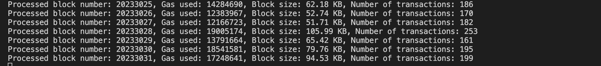

# BlobSight

Real-time Ethereum L2 and blob transaction monitor with proto-danksharding support.

## Overview

BlobSight is a high-performance Ethereum monitoring tool designed to track Layer 2 (L2) transactions and upcoming blob data in real-time. Built with Rust, it offers robust handling of Ethereum WebSocket connections, efficient transaction filtering, and rapid data storage using RocksDB.

## Features

- Real-time monitoring of Ethereum for L2-related transactions
- Support for Optimism, Arbitrum, and zkSync
- Ready for EIP-4844 (proto-danksharding) blob transactions
- Concurrent transaction processing
- Efficient data storage with RocksDB
- RESTful API for querying transaction data and statistics

## Prerequisites

- Rust 1.54 or higher
- An Ethereum node with WebSocket support (e.g., Infura, Alchemy)

## Setup
1. Install Cargo 

2. Update Cargo in PATH
export PATH="$HOME/.cargo/bin:$PATH"

3. Clone the repository

## Run
1. Cargo Build
cargo build

2. Cargo Run
cargo run -- --start-block [start_block_number] --end-block [end_block_number] --rpc-url [your_rpc_url_endpoint]